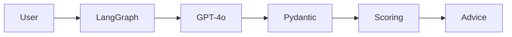

# Small Business Loan Assistant

<div align="center">
  
  
  
</div>

## Overview
An AI-powered chatbot that guides users through small business loan applications ($20-$50 range) with:
- **Conversational data collection**
- **Creditworthiness scoring**
- **Personalized advice**

## Key Features
| Feature | Description |
|---------|-------------|
| **Dual Flow** | Separate paths for existing businesses vs. startups |
| **Dynamic Scoring** | Real-time credit scoring (0-10) with explanations |
| **Structured Output** | Automatic Pydantic data extraction |
| **Memory** | Conversation history tracking per user |

## Technical Stack


## Prerequisites
```bash
pip install langgraph langchain-openai pydantic
```

## Configuration
Set OpenAI API key:
```python
os.environ["OPENAI_API_KEY"] = "your-api-key"
```
Run Interactive Demo
```bash
python loan_assistant.py
```

## Workflow
1. Data Collection:
- Business details (type, age, income)
- Loan requirements (amount, purpose)
- Financial situation (existing loans, guarantees)
2. Scoring:
  ```json
  {
  "overall_score": 7.5,
  "field_scores": [
    {"field": "income", "score": 8, "reason": "Stable income stream"},
    {"field": "business_age", "score": 5, "reason": "New venture"}
  ]
}```
3. Advice Generation (for scores ≤5):
"Build 3-6 months of transaction history"
"Consider smaller initial loan amount"

## Important Notes
1. Requires GPT-4o API access
2. Test with mock data before production use
3. Modify COLLECTION_TEMPLATE for localization

License
MIT © Seng Pan
Not financial advice - for demonstration purposes only
